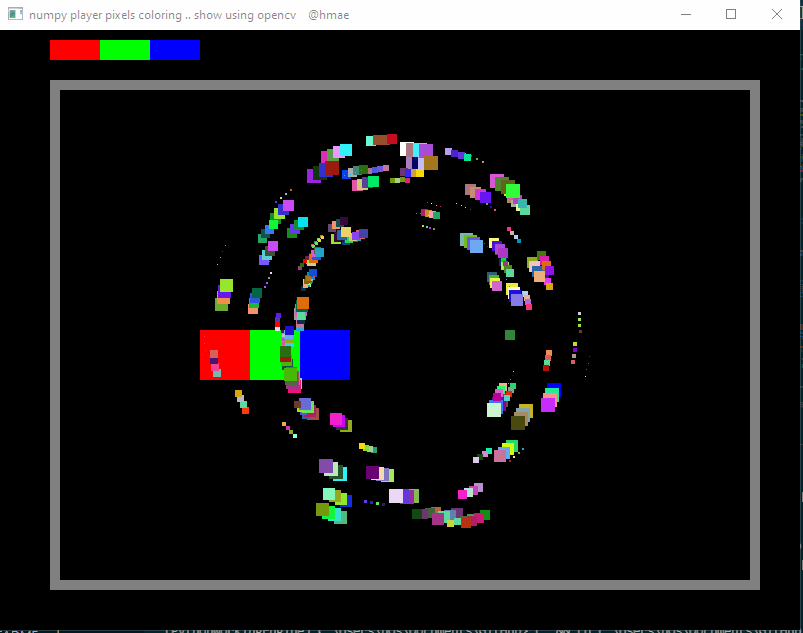
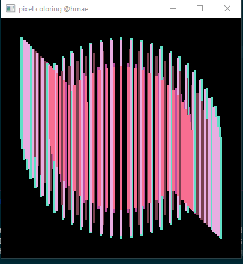

# customize pixels throw numpy
simple script to work on numpy 3d-array
by modify it's values by color values

you can get drawable image 🎴 ..

read and show using opencv modules

let creativity go on 👌♥️

| colorful pixels ;D
| :---: 
| 
| 
