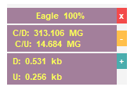
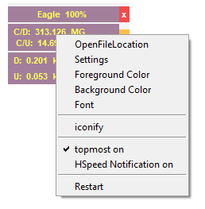
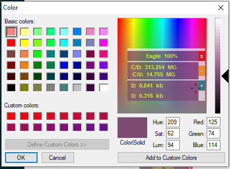

## Hello World
Home made internet speed usage indicator.

>#### **# features:**
>- support color customizations
    - foreground
    - background
>- window opacity.
>- change font.
>- desktop warning notifications on high speed usage.
>- always on top option

>#### **# requirements:**
>- win10toast
>- psutil

|  
| :---:
| **main window** 

| 
| :---:
| **sub menu** 

| 
| :---:
| **colors**

