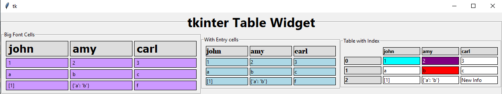
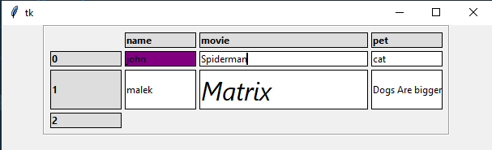

# tkinter table

Since tkinter is very widely simple UI Toolkit. it is very powerful due to its simplicity. But it provide the nature of widgets [the core for input/output widgets] as Labels, Entries, Frames, Buttons, ComboBoxes, Progressbars, Toplevel windows, canvases more and more ..
but why not it doesnt support Tables ! . btw i am one of tkinter fans xD

From my previous project i used to depend on Tables to preview sort of data as output widget. so i am glad to create this Table Widget, verysimple to use and provide input/output system depending on [labels and entries] for table cells beside Headers and Indices.

| **Overview**
| :---: 
| 

### Usage
```python

import tkinter
from tkTable import TkTable

UI = tkinter.Tk()

names = ['name', 'movie', 'pet']

indexlist = [0, 1, 2]

Source = [['john', 'Spiderman', 'cat'],
          ['malek','Matrix', 'dog']]
# Affect how cells added to Table          
SystemType = 'grid'
# Entry and Labels looks similar in presenting data.
# but Labels is easier for Style Customization and much Pretty for Presentations 
CellType = 'entry'

mytable = TkTable(
    master=UI,
    data=Source,
    header=names,
    index=indexlist,
    geometrysystem=SystemType, 
    celltype=CellType
    )

mytable.pack()

# To Edit cells
# Method mytable.get return a tkinter Variable of the cell.
# That Variable have access to the Widget itself through master attribute
mytable.get(row=0, col=0).master.config(bg='purple')
# result should affect 'john' cell
mytable.get(row=1, col=1).master.config(font=('Segoe UI', 24, 'italic'))
# result should affect 'matrix' cell
mytable.set(row=1,col=2, info='Dogs Are bigger Than Cats')
# result should affect 'Dog' cell


UI.mainloop()
```
| **Example**
| :---: 
| 
### Benefits
it can support alternative widgets for cells ! try to create ur own customized Widget in utilties and provide a name for it in cell function . then load it simply xD.
it support styles by editing Utilities file or Feed the Widget itself directly.

### TODO

- [ ] add more styles
- [ ] customize cells widgets
- [ ] add functionality for Entered data (excel simulation)

>from my scope, i think it can be improved to be very powerfull widget with some tweaks here and there .

Wait for more soon .

